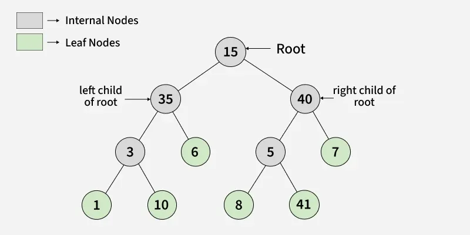

# Sorting Algorithms

## [Insertion Sort](https://www.geeksforgeeks.org/dsa/insertion-sort-algorithm/)
One of the most simple sorting techniques. You pick an unsorted element and insert it into the sorted part of the array. 

### Process
1. Start with the second element, since we can assume our first one is already sorted. Since it is the only element in the sorted part of the array.
2. Compare the two, if the second element is smaller than the first, swap them. 
3. Then go to the third element and compare it with the first two, and put it in the correct position.
4. Repeat until the array is sorted.

### Non-code example
Imagine you want to sort a deck of cards. You take a card and use it to start. Then you take the second one and place it either in front or behind the first card. Then the third one and so until you sorted the deck.

## [Bucket Sort](https://www.geeksforgeeks.org/dsa/bucket-sort-2/)
Sorting technique that involves dividing elements into various groups, or buckets. These are formed by evenly distributing elements. 

Once divided they can be sorted using other sorting algorithm. After the sort the elements are gathered in an ordered fashion.

This algorithm
- Works well with input arrays of uniformly distributed elements across a range.

### Process 
Create <mark>***N***</mark> empty buckets (lists, vector, array, etc.) and do the following for every element in ***arr[i]***:
1.  Insert ***arr[i]*** into ***bucket[n\*array[i]]***.
    - The purpose of this calculation is to determine the bucket it belongs to.
    - This means that all the elements within this bucket are within a specific range.
    - If we have 10 buckets for an array of 100 elements, then each bucket will contain elements in the range of 10. So bucket 0 will contain elements from 0 to 9, bucket 1 will contain elements from 10 to 19, and so on.
2. Sort individual buckets using [insertion sort](#insertion-sort).
3. Concatenate all sorted buckets.

### Non-code example
Imagine having colored balls that you want to sort by color. You would insert them into buckets based on their approximate color. Say sorting all shades of blue into one bucket, all reds in another and so on. Then you can bring a more precise sorting algorithm to sort the balls within each bucket.

In short, this method is as if you eyeball. Which can yield a good result that can later be refined with a more precise sorting algorithm.

The purpose to this is that we are making a big problem smaller by breaking it into smaller problems. This is a common theme in algorithms and is known as the divide and conquer approach.

Another example would be the deck of cards. You can sort them by suit first.

### Complexity
O(n + k) in a case where we have even distribution of elements across the buckets. Where n is the number of elements and k is the number of buckets.

O(n^2) in the worst case when all elements are in the same bucket. In this case we are just doing insertion sort on all the elements, thus taking its worst case time complexity.

[Example](./Exercise%20Notes.md#two-sum)

# Searching Algorithms

## [Binary Search](https://www.geeksforgeeks.org/dsa/binary-search/)
Binary search is a searching algorithm that works on sorted arrays. It repeatedly divids the search interval in half to find the target value in O(log n) time complexity.

The conditions to apply binary search are:
1. The data must be sorted.
2. Acces to any element in the array must be O(1), which is the case for arrays but not for linked lists.

Algorithm:
1. Dive the search space in two by finde the middle index.
2. Comapre the middle index with the target value.
|   - If they are equal, return the middle index.
|   - If the key is not at the middle choose which half of the array to continue searching in.
|       - If the key is less than the middle element, continue searching in the left half.
|       - If the key is greater than the middle element, continue searching in the right half
3. Repeat the process until the key is found or the search space is empty.

### Non-code example
Imagine you have a recording of a day and you want to find the time when a cup was taken from a table. You can start in the middle of the recording, if the cup is not there, it means it was taken in the first half of the day. If it is still there it means it was taken in the second half of the day. Then you can repeat this process until you find the exact time when the cup was taken.


# [Greedy Algorithms](https://www.geeksforgeeks.org/dsa/introduction-to-greedy-algorithm-data-structures-and-algorithm-tutorials/)
Greedy Algorithms build solutions piece by piece, always choosing the next piece that offers the most immediate benefit. They make the locally optimal choice at each step with the hope of finding a global optimum.

An optimization problem can be solved by a greedy algorithm if it has the following properties:
- The optimal can be constructed by making the best local choice at each step.
- The optimal solution contains optimal solutions to subproblems. This is known as the optimal substructure property.


Some popular greedy algorithms include:
- Dijkstra's Algorithm for shortest paths in a graph.
- Kruskal's and Prim's Algorithms for minimum spanning trees.
- Huffman Coding for data compression.
- Fractional Knapsack Problem.

How does it work?
1. Start with the initial state of the problem.
2. Consider the current available options.
3. Choose the option that seems best at the moment.
4. Repeat until the problem is solved.

## Non-code example
You have a set of coins with values of 1,2,5 and 10 and you need to give the minimum amount of change for 39. You would start by giving the largest coin possible, which is three 10 coins, then you would give a 5 coin, then two 2 coins. This way you are giving the minimum amount of coins possible.
By using the best solutions to the subproblems, we are able to find the best solution to the overall problem. This is the essence of the greedy algorithm.

Something important to point in this example is that the 1 denomination is crucial for the greedy algorithm to work. If we didn't have the 1 denomination, we would not be able to give the exact change for 39. Since the 1 will definetely cover any possible remainder that we might have after giving the larger coins. This is an example of how the greedy algorithm relies on the optimal substructure property to work. If we didn't had the 1 denomination, we would have to consider other algorithms that can handle cases where the optimal substructure property does not hold, such as dynamic programming.


### Characteristics of Greedy Algorithms
1. Greedy algorithms are easy to implement and fast.
2. Between Greedy and Dynamic Programming, greedy algorithms are prefered when choosing between both. 
3. Greedy doesn't consider previous choices, nor does it look ahead. Only the current moment.


# [Divide and Conquer Algorithms](https://www.geeksforgeeks.org/dsa/divide-and-conquer/)

# [Dynamic Programming](https://www.geeksforgeeks.org/dsa/introduction-to-dynamic-programming-data-structures-and-algorithm-tutorials/)
Dynamic Programming (DP) is a method for solving complex problems by breaking them down into simple subproblems, storing the result of said subproblems to avid reduntdant work.

The core idea goes like this: Remembering the past to solve the future. We store the results of subproblems in a table (usually an array or a hash map) so that when we encounter the same subproblem again, we can simply look up the answer instead of recomputing it.

It is important to note that the lookup must be efficient for DP to be effective.

## When to use DP
1. [Optimal Substructure](https://www.geeksforgeeks.org/dsa/optimal-substructure-property-in-dynamic-programming-dp-2/): The optimal solution of subproblems forms the optimal solution of the overall problem.
    - Finding the shortest path in a graphh is an example. We can find the shortst path from a source to an intermediate node, and then from that intermediate node to the destination.
    - For example, not knowing the shortest path to a Plaza, but knowing the shortest one to a restaurant, and from that restaurant knowing the shortest path to the plaza, we can combine these two to find the shortest path from our location to the plaza. 

2. [Overlapping Subproblems](https://www.geeksforgeeks.org/dsa/overlapping-subproblems-property-in-dynamic-programming-dp-1/): The problem can be broken down into subproblems which are repeated.
    - The Fibonacci sequence is an example of this. Since for example the calculation of every element above the first and second, requires these two to be sumed.

## Approaches to DP
1. Top-Down Approach (Memoization):
    - In the top down approach we keep the solution recursive and add to the memoization table to avoid repated calls.
    - Basically is looking for the very base case and then building up the solution from there, while storing the results in a table to avoid redundant work.
    - In a way the problem has to get to the absolute bottom and then build up from there, which is why it is called top down.
2. Bottom-Up Approach (Tabulation):
    - We start with the base cases instead of having to look for them in the recursive call.
    - We write an iterative solution that builds up.

In short terms, recursion is the process of splitting the problem until we reach the base case and then building up the solution from there, while iteration is the process of building up the solution from the base case. 

## Example 
For example, the Fibonacci sequence is a classic example of a problem that can be solved using DP. The problem with a naive recursive solution is that if we want to reach a number n, we first need to calculate the two preceding numbers, which require the two preceding ones and so on. With DP, instead of running a calculation for the same number multiple times, we store the results in a table and simply look them up when needed.

```cpp
// RECURSIVE FUNCTION WITH MEMOIZATION
int fibRec(int n, vector<int> &memo) { // It is important to note memo here is a reference, this is because we want to modify only one copy of vector, not pass a copy of it in each recursive call, which would defeat the purpose of memoization and lead to a much higher time and space complexity.
  
    // Base case.
    // In essence this will stop the recursion when we reach the first two numbers of the sequence, which are 0 and 1. This is because the Fibonacci sequence is defined such that F(0) = 0 and F(1) = 1. So when n is 0 or 1, we can directly return n as the result without further recursive calls. This is the only time we return n, in all other cases we will be returning the result of the recursive calls, which will be stored in the memoization vector for future use.
    if (n <= 1) { 
        return n;
    }

    // To check if output already exists
    if (memo[n] != -1) { // If the result for n is already stored in memo, return it.
        return memo[n]; //We already had the result for n, so we return it without doing any further calculations.
    }

    // We didn't have the result so we will call another recursive call.
    // For example the first calculation time we want the sum of 0 and 1 will be stored in the memoization vector, so the next time we want to calculate the sum of 0 and 1, we can simply look it up in the vector instead of doing another recursive call.
    // Calculate and save output for future use
    memo[n] = fibRec(n - 1, memo) + fibRec(n - 2, memo);

    return memo[n];
}


// RECURSIVE START
int fib(int n) { // First iteration of the recursive function.
    vector<int> memo(n + 1, -1); //Vector to store the results.
    // Space of n + 1, because we want to store the results from 0 to n, which are n + 1 numbers.
    // Initialized in -1, this number indicating a non-stored result. We can use any number that is not a valid output, in this case -1 works because the Fibonacci sequence does not contain negative numbers.
    return fibRec(n, memo); // Start the recursive function with the original input n and the memoization vector.
}

// START
int main() { // We start here.
    int n = 5; // We want the 5th number of the secuence.
    cout << fib(n); // We call the first iteration of the recursive function.
    return 0;

    // Reminder: We are asking for the nth number in the sequence, not if n is in the sequence. This is a common mistake, but it is important to note that we are asking for the value of the nth number, not if n is a valid input. 

    // At first our recursion will break the problem down, wanting to look for the 4th and 3rd number, then the 3rd will break down into the 2nd and 1st, and so on until we reach the base case. Once we reach the base case, we start building up our solution, storing the results in the memoization vector as we go up. This way, when we encounter a subproblem that we have already solved, we can simply look up the result in the memoization vector instead of recomputing it.
}
```
# [How to differentiate between DP and Divide and Conquer](https://www.geeksforgeeks.org/dsa/comparison-among-greedy-divide-and-conquer-and-dynamic-programming-algorithm/)
The main difference between DP and Divide and Conquer is that DP requires usage of a table to store the results of subproblems, while Divide and Conquer does not.

For example in a Merge Sort, which is Divide and Conquer, you don't need to store the results of the subproblem. Your result is the sorted array, which is built up from the results of the subproblems, but you don't need to store the results of the subproblems in a table. You can simply merge the sorted subarrays together to get the final sorted array.

The simple question is: Can I store a result that I know will be used in the future? If the answer is yes, then you can use DP. If the answer is no, then you cannot use DP and you might want to consider using Divide and Conquer instead.

In merge sort you can have an array [2,4] and a [3,7] that merges into [2,3,4,7]. You will never need the [2,4] or the [3,7] again, so you don't need to store them in a table. You can simply merge them together and move on.

# Backtracking

# Graph Algorithms

# Tree Algorithms

# String Algorithms

# Bit Manipulation

# Mathematical Algorithms

# Computational Geometry

# [Disjoint Set Union (Union-Find)](https://www.geeksforgeeks.org/dsa/introduction-to-disjoint-set-data-structure-or-union-find-algorithm/)
Two sets are called  disojint when they don't have elements in common. The ***Disjoint Set*** is a data structure stores those sets and supports the following operations:
1. Mergin of the sets using the ***Union*** operation.
2. Finding the representative of a disjoint set using the ***Find*** operation.
3. Check if two elements belong to a same set or not. We do this by finding the representative of each element and checking if they are the same.

A representative is an element that is used to represent the set. It is usually the first element of the set, but it can be any element of the set. The representative is used to identify the set and to perform the union operation.

Imagine a group of people, person A is friend of person B, and person B is friend of person C. Then we can say they are in the same friend group, even if person A and person C are not directly friends. 

With this we can imagine a different set of person D, which is friends with person E and person F. But E and F are not directly friends, but they are in the same friend group. So E and F are indirect friends by concept of being friend of a friend, thus being in the same friend group.

In this case we could say this are A's and D's, we are making them the representatives of their respective sets. Then we can say that A and D are not in the same set, but B and C are in the same set as A, and E and F are in the same set as D.

So even if all of the member of the set are not directly connected to the representative, they are still in the same set because they are connected to the representative through other members of the set.

## Data Structures Used
1. Array: In an array of integers the i'th index is a representative of the i'th item. In some way i has no representative, but is the representative of itself. So we can say that the representative of i is i, which is a common way to identify the representative in the array implementation of the disjoint set.
2. Tree: If two elements are in the same tree, then they are in the same disjoint set. The root node (or the topmost node) of each tree is the representative. 

There is always a single representative for each set. A simple rule to identify the representative is if 'i' is the representative of a set, then Parent[i] = i. This means that the representative is its own parent, which is a common way to identify the representative in the array implementation of the disjoint set. In the case of a tree you can climb up the tree until you reach the root node, which is the representative of the set.

## Example
```cpp
#include <iostream>
#include <vector>
using namespace std;

class UnionFind {
    vector<int> parent; // This vector will store the parent of each element. 
    //At the start, each element is its own parent, meaning each element is the representative of its own set. As we perform union operations, we will update the parent vector to reflect the new representatives of the sets.
public:
    UnionFind(int size) { // Constructor to initialize the Union-Find data structure with a given size.
      
        parent.resize(size); // Resize the parent array to the given size.
      
        // Populate the parent array such that each element is its own parent, meaning each element is the representative of its own set.
        for (int i = 0; i < size; i++) {
            parent[i] = i; // 1 is parent to 1, 2 is parent to 2, and so on. This means that at the start, each element is in its own set.
        }
    }

    // Find the representative (root) of the
    // set that includes element i
    int find(int i) {
      
        // If i itself is root or representative
        if (parent[i] == i) {
            return i;
        }
      
        // Else recursively find the representative 
        // of the parent

        // Since parent[1] = 2, then we know to now try to look up in parent[2], which is 2, meaning that 2 is the representative of the set that includes 1. So we can say that 1 is in the set represented by 2.

        // If parent[2] = 3, then we would look up parent[3], and so on until we find the representative of the set. This is because the representative is the element that is its own parent, meaning that it is the root of the tree in the tree implementation of the disjoint set.
        return find(parent[i]);
    }

    // Unite (merge) the set that includes element 
    // i and the set that includes element j
    void unite(int i, int j) {
      
        // Representative of set containing i
        // Find(1) = 1
        int irep = find(i);
      
        // Representative of set containing j
        // Find(2) = 2
        int jrep = find(j);
       
        // Make the representative of i's set
        // be the representative of j's set
        // This yield parent[1] = 2, meaning that 1 and 2 are now in the same set, with 2 being the representative of the set. So we can say that 1 is now in the set represented by 2.
        // The array now looks like this: [0, 2, 2, 3, 4], meaning that 0 is in its own set, 1 and 2 are in the same set represented by 2, and 3 and 4 are in their own sets.
        parent[irep] = jrep;
    }
};

int main() {
    int size = 5; // Size of the universe of elements (0 to 4)
    UnionFind uf(size); // Create a Union-Find data structure with 5 elements (0 to 4)
    uf.unite(1, 2);
    uf.unite(3, 4);
    bool inSameSet = (uf.find(1) == uf.find(2));
    cout << "Are 1 and 2 in the same set? " 
         << (inSameSet ? "Yes" : "No") << endl;
    return 0;
}
```

# Miscellaneous Algorithms


# Algorithm Design Paradigms

## Divide and Conquer

## Preprocessing

### Prefix Sum
Technique used to solve problems involving two indeces in an array or operations on subarrays.

The benefit is that after a one-time processing step, queries take O(1) time. Basically storing a result that we know will be repeatedly used in the future.

So, if there are m queries, the complexity will be of O(n + m) instead of O(n*m). With n being the size of the array and m being the number of queries.

Prefix: Part of a sequence that starts on the first eleement extending up to a certain position. For example the prefix i of an array icnludes all elements from 0 to i. So the prefix 3 of an array [1,2,3,4,5] is [1,2,3].

Prefix Sum: Like the name suggest, instead of just storing the prefix, we store the sum of the prefix. So the prefix sum 3 of the array [1,2,3,4,5] is 6. This is because 1 + 2 + 3 = 6.

#### Prefix Sum for Ranges
For a query that asks for the sum of elements between the index L and R, we can obtain the result by doing prefixSum[R] - prefixSum[L-1].

Why not prefixSum[R] - prefixSum[L]? Becuase using the prefix sum of L will disregard the element at index L, which is not what we want. We want to include it in our sum, thus we need to use the prefix sum of L-1.


# Data Structures

## [Stack](https://www.geeksforgeeks.org/dsa/stack-data-structure/) 
A stack is a liner data structure that follows a particular order in which operations are performed.

The order may be in either of the following:
1. LIFO
    - Last In First Out
    - The last element added to the stack will be the first one to be removed.
2. FILO
    - First In Last Out
    - The first element added to the stack will be the last one to be removed.

Do not be confused as these two are the same thing, just different ways to say it. The main idea is that the last element added to the stack will be the first one to be removed.

Think of a pile of plates that needs to be washed. The most recently added plate to the pile will be the first one to be washed, and the first plate added to the pile will be the last one to be washed. This is a real-life example of a stack data structure.

### [Monotonic Stack](https://www.geeksforgeeks.org/dsa/introduction-to-monotonic-stack-2/)
A monotonic stack is a special type of stack in which elements are kept in either increasing or decreasing order. The main idea being keeping this order while pushing or popping elements from the stack.

When a new element is pushed, it is compared with the top of the stack. If the order is violated, elements are popped until the property is fixed. Then the new element is pushed.

Imagine the plates are now based on their size, and we want to keep a decreasing order. When a plate that is to be added is larger than the top plate, we need to pop the smaller plates until we find a plate that is larger than the new one, or until the stack is empty. Then we can push the new plate on top of the stack.

## [Queue](https://www.geeksforgeeks.org/dsa/queue-data-structure/)
A Queue is a linear data structure that follows a particular order in which operations are performed. The order is FIFO, which stands for First In First Out. This means that the first element added to the queue will be the first one to be removed.

It can be used as a buffer for when we have a speed mismatch between two divices. For example, if we have a printer that is slower than the computer sending the print jobs, we can use a queue to store the print jobs until the printer is ready to process them. This way, the computer can continue sending print jobs without having to wait for the printer to finish processing the previous job.

A more common example would be making queues for waiting for a service, the cinema, the bank, etc. The first person to get in line will be the first one to be served.


## [Linked List](https://www.geeksforgeeks.org/dsa/linked-list-data-structure/)
A linked list is a linear data structure where individual items are not necessarily stored one after another in memory. The individual items are called nodes which contain the following:
1. Data: The value stored in the node.
2. Pointer: A reference to the next node in the list.

There's also some important things to note about specific nodes:
- The head node is the first node in the list, it is the starting point of it.
- The tail node is the last node in the list, it is the end point of it. The tail node's pointer is usually set to null to indicate that it is the end of the list.


What is the difference between a linked list and an array?

Linked List:
- Data is stored non-contiguously in memory.
- Memory is allocated individually for each node.
- Insertion and deletion operations are more efficient since only the specific nodes need to be updated, not the entire structure.
- Access is sequential, meaning you have to traverse the list from the head to reach a specific node.

- Arrays:
- Data is stored contiguously in memory.
- Memory is allocated for the entire array at once.
- For the previous reasons is that insertion and deletion operations can be less efficient, especially if they involve shifting elements.
- Access is random, meaning you can directly access any element using its index.

### [Singly Linked List](https://www.geeksforgeeks.org/dsa/singly-linked-list-tutorial/)
A singly linked list is a type of linked list where each node contains a pointer to the next node in the list, but not to the previous one. This means that you can only traverse the list in one direction, from the head to the tail.

Advantages:
- Dynamic size, unlike arrays.
- Efficent insertion and deletion
    - Since you only need to update the pointers of the adjacent nodes. Middle insertions can be done in O(1) time if you have a pointer to the node after which you want to insert, while in an array it would require shifting elements and thus O(n) time.
- Can implement other data structures like stacks and queues.

Disadvantages:
- Extra memory required for pointers.
- No direct access
    - You need to traverse the list to access a node, which can lead to O(n) time complexity for access operations, while in an array it is O(1) due to direct indexing.


### [Doubly Linked List](https://www.geeksforgeeks.org/dsa/doubly-linked-list/)
A doubly linked list is a type of linked list where each node contains two pointers: one to the next node and one to the previous node. This allows for traversal in both directions, from head to tail and from tail to head.

- Advantages:
- Bidirectional traversal, which can be useful for certain applications.
- Efficient deletion of nodes as long as you have a pointer to the node to be deleted, since you can easily update the pointers of the adjacent nodes.
- Insertion on both ends can be done in O(1) time if you have pointers to the head and tail.
- Easy for Deque or navigation features. 
    - For example, in a web browser, you can navigate back and forth between pages using a doubly linked list to keep track of the history.

- Disadvantages:
- Extra memory usage per Node.
- More complext implementation
    - Handling of the pointers can be more complex during insert and delete which leads to an increased chance of errors like broken links or null pointer issues.
- Slower operations due to overhead.
- Not cache friendly
    - Due to non-contiguous memory allocation, transversals may be slower than arrays.

## [Binary Tree](https://www.geeksforgeeks.org/dsa/introduction-to-binary-tree/)
A binary tree is a non-linear hierarchical data structure where each node has at most ***two*** children, referred to as the left child and the right child. The topmost node is called the root, and nodes with no children are called leaves.



Each node is composed of three parts:
1. Data
2. Pointer to the left child
3. Pointer to the right child

### Terminology
- Parent Node: A node that is the predecessor of another node.
- Child Node: A node that is a successor of another node.
- Ancestors of a node: All nodes that are on the path from the root to that node, including the node itself.
- Descendants of a node: All node that lie in the subtree rooted at that node, including the node itself.
- Subtree of a node: If the root node has a left child and a right child, then the left child and all its descendants form the left subtree, and the right child and all its descendants form the right subtree. And so one for the left and right child of each node.
- Edge: The connection between a parent node and a child node.
- Path in a binary tree: A sequence of nodes and edges connecting a node with a descendant.
- Leaf Node: A node with no or null children.
- Internal Node: A node with at least one child.
- Depth/Level of a node: The number of edges from the root to the node. The root node is at depth 0, its children are at depth 1, and so on.
- Height of a Binary Tree: The number of edges on the longest path from root to a leaf.

### Properties
1. The maximum number of nodes at level 'L' is 2^L.
    - Example: At level 1, that being the two children of the root, we can have a maximum of 2^1 = 2 nodes. At level 2, that being the children of the children of the root, we can have a maximum of 2^2 = 4 nodes, and so on.
2. The maximum number of nodes in a binary tree of height 'H' is 2^(H+1) - 1.
    - Example: For a binary tree of height 2, the maximum number of nodes is 2^(2+1) - 1 = 7.
3. Total number of leaf nodes in a binary tree = total number of nodes with 2 children + 1.
    - Example: If we have a tree with 3 nodes with two childre, The first node of course is the root, and then the root's children are the other two nodes with two children. And if the 2 children of the root have 2 children each, then we have a total of 3 nodes with two children, which means we have a total of 3 + 1 = 4 leaf nodes.
4. In a binary tree when N nodes, the minimum possible height or levels is log2(N)
5. A binary tree with L leaves has at least log2(L) + 1 levels.

### Operations on a binary tree

#### 1. Traversal
The process of visiting each node in a binary tree exactly once in a specific order. The three common types of traversal are:
1. Inorder Traversal: Left, Root, Right
2. Preorder Traversal: Root, Left, Right
3. Postorder Traversal: Left, Right, Root

Also you can do:
1. Depth First Traversal: This can be implemented using a stack or recursion. It explores as far as possible along each branch before backtracking.
    - So for going all left first, then all right, and then the root, we would be doing a postorder traversal.
2. Breadth First Traversal: This can be implemented using a queue. It explores all the nodes at the present depth before moving on to the nodes at the next depth level.
    - While in DFS we first check the children, in BFS we first check the siblings. So for going all the nodes at level 1, then all the nodes at level 2, and so on, we would be doing a breadth first traversal.

In the following tree
```
        1
       / \
      2   3
     / \
    4   5
```

The first element checkd in DFS considering going all left would be the 4. In BFS we check first the root.


#### 2. Search


#### 3. Insertion and Deletion

### Advantages and Disadvantages of Binary Trees

Advantages:
1. Efficient Search: Using a [Binary Search Tree](https://www.geeksforgeeks.org/dsa/binary-search-tree-data-structure/) is efficient when searching for a specific element, as each node has at mos two children, which allows for a logarithmic time complexity in the average case.
2. Memory Efficient: Binary trees require less memory than other data structures.
3. Binary trees are relatively easy to understand and implement, making them a good choice for many applications.

Disadvantages:
1. Limited structure: If a tree requires more than 2 children per node a different data structure would be more appropriate.
2. Space inefficiency: Mostly because of the pointers, which can lead to increased memory usage compared to arrays.


## [Heap](https://www.geeksforgeeks.org/dsa/heap-data-structure/)
A heap is a complete binary tree (TODO: Section on complete binary trees) that satisfies the heap property. For every node, the value of its children is greater or equal than its own value. Heaps are usually used to implement priority queues where the smallest (or largest) element is always at the root of the tree, making it easy to access.

An example of a min-heap is:
```
        1
       / \
      3   5
     / \
    4   8
```

In this min-heap, the value of each node is less than or equal to the values of its children. The smallest element is at the root (1), and as you go down the tree, the values increase.

An real-life example would be a hospital emergency room where patients are treated based on the severity of their condition. The patient with the most severe condition (the smallest value in a min-heap or the largest value in a max-heap) is treated first, while patients with less severe conditions wait their turn.